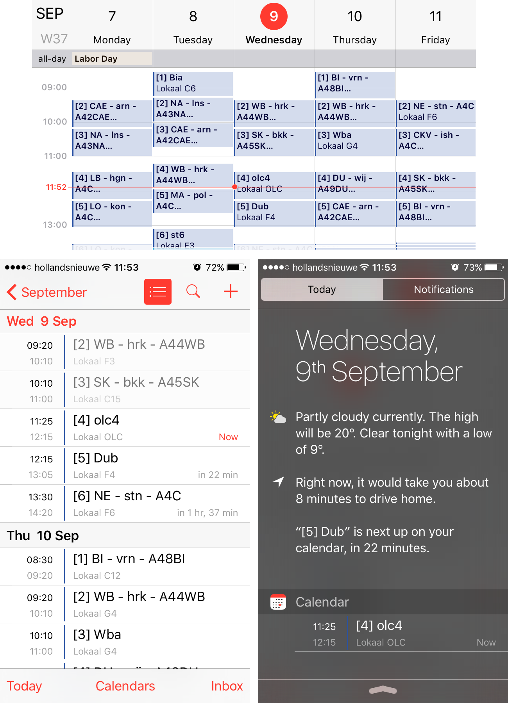

<p align="center">
  
  <br/><br/>
  <a href="https://nodei.co/npm/magister-calendar/"></a>
</p>

<p align="center">
  Automatically plan your <a href="http://www.schoolmaster.nl/">Magister</a> appointments in your <a href="https://google.com/calendar">Google calendar</a>.<br/>
  Uses <a href="https://github.com/simplyGits/MagisterJS">Magister.js</a> and the <a href="https://developers.google.com/google-apps/calendar/">Google Calendar API</a>. Written in <a href="https://nodejs.org/">NodeJS</a>.
</p>

---

## Requirements
- Unix environment (For example Ubuntu, CentOS or Debian)
- NodeJS server (`nodejs` and the node package manager `npm`)
- Cronjob (`crontab` or some other cron program)
- A Google account
- Basic programming knowledge and common sense

Although this project wasn't built for it, Magister Calendar can also run on Android (using [JXcore](http://jxcore.com)) and Windows. 

## Installing
Make sure that all requirements are present on your system.

### 1. Enable the Google Calendar API
Before being able to use Magister Calendar, you'll have to enable the Google Calendar API through the Google Developer Console. [This tutorial](https://github.com/lesander/magister-calendar/blob/master/ENABLEAPI.md) I wrote will help you get through the maze of Google's Developer Console.

### 2. Download Magister Calendar

You can download the latest release [here](https://github.com/lesander/magister-calendar/releases), or do a `git clone https://github.com/lesander/magister-calendar.git`. Extract the project in a folder and put the earlier downloaded `client_secret.json` in the same directory.
Your working directory should look somewhat like this:
```
├── assets/
│   └── tools.js
├── cache/
├── client_secret.json
├── config.json
├── firstrun.js
├── magister-calendar.js
├── package.json
└── .gitignore
```
Now we're going to install all the dependencies of Magister Calendar. Do so by running `npm install` inside the working directory. This can take a while, as the package manager will download all the required depencencies, including the dependencies of the dependencies, and so forth.


### 3. Authorize Magister Calendar

Awesome, you're almost ready to start using Magister Calendar. The last thing we need to do before we start the cronjob, is authorize the application with Google. You can do this easily by firing up a terminal and cd'ing to the project folder and running `nodejs firstrun.js`. Make sure you've got the JSON file you downloaded earlier in the same directory and have renamed it to `client_secret.json`. When running JXcore on Android (instead of NodeJS), make sure to manually set the `HOME` environment variable (eg: `HOME=/my/home/path jx firstrun.js`).

The script will produce an authorization URL you will need to visit in your browser. Click the link and then proceed to login with your Google account. After authorizing your application, you will be redirected to the redirect URL you provided earlier, with an access token attatched to it. Copy that access token and paste it in the terminal running the firstrun.js script. When it's done obtaining the access and refresh token, you're all set with all the Google authentication stuff.

### 4. Configuring Magister Calendar
The main configuration file of Magister Calendar is called `config.json` and uses JSON (duuh). You can change the settings to your liking, I'll explain some of the options here.

```json
{ "calendar": "primary" }
```
The calendar we're planning the appointments in. Set to `primary` to use the primary calendar, or another valid [calendar id](https://developers.google.com/google-apps/calendar/v3/reference/calendarList/list).

---

```json
{ "period": "default" }
```
The amount of days to schedule appointments for. When set to `default`, the remaining days of the current week will be loaded, or when it's past `day_is_over_time` on friday (or it's weekend) the next work week will be loaded.

---

```json
{ "day_is_over_time": 16 }
```
To be used in combination with `period="default"`. The value stands for the hour (in 24h format) when the current day will be seen as over by the default period algorithm calculator. For example, when `day_is_over_time=16`, the current day will be seen as over, after 16:00 local time.

---

```json
{ "magister_url": "", "magister_username": "", "magister_password": "" }
```
These three settings are basically the only required settings before you can use Magister Calendar. `magister_url` should be the full URL to the Magister 6 website you normally login to, for example `https://dspierson.magister.net`.

---

```json
{ "remove_cancelled_classes": true }
```
Can be either `true` or `false`. When set to true, Magister Calendar will cancel all appointments on your calendar which have been cancelled in Magister. When set to `false`, only the title of the appointment will be changed.

---

```json
{ "blacklist": ["", "KWT"] }
```
Appointments with descriptions matching items in the blacklist will not be planned in your calendar. By default, appointments from Magister with empty descriptions and with the description "KWT" will be ignored.

---

```json
{ "reminders": [{"method": "popup", "minutes": 5}] }
```
The `reminders` array can be used to get up to 5 different reminders for every appointment. Available methods are `popup`, `email` and `sms`. The `minutes` key stands for the amount of minutes before the start of the appointment, when the reminder will be sent. For more information see the [reminders overrides](https://developers.google.com/google-apps/calendar/v3/reference/events/insert) at the Google Calendar API docs.

---

The default [`config.json`](config.json) file can be found in the root of the project's folder.

Please note that before setting up a cronjob, it'd be clever to try out Magister Calendar with your configuration manually, by running `nodejs /path/to/magister-calendar.js` and checking the result for any thrown notices, warnings and errors.

### 5. Setting up the cronjob
Open your favourite cronjob manager and add the command `nodejs /path/to/magister-calendar.js` to the cron file. You should not make the cronjob run more than once per minute, because Magister Calendar can take up to a minute to finish executing.

In this example, we'll be using `crontab`, one of the most common cronjob managers. To start editing your cron file, run `crontab -e`. Add the following line at the end of the file to execute Magister Calendar every minute:
`*/1 * * * * cd /path/to/magister-calendar; nodejs magister-calendar.js > cron.log`. For more on the crontab syntax, [see this article](http://www.adminschoice.com/crontab-quick-reference) or run `man crontab` in a terminal.

:warning: Note that when using JXcore on Android, you'll have to manually set your `HOME` path before running Magister Calendar. You can either permanently set this in your `~/.profile`, or define it every time before running Magister Calendar: `HOME=/my/home/directory jx magister-calendar.js`.

## Using Magister Calendar
Once you've got the cronjob up and running (or ran `magister-calendar.js` successfully at least once), you can check your filled in calendar at [Google Calendar](https://google.com/calendar) or on your favourite calendar application synced with Google Calendar.



## Contributing

If you'd like to contribute to Magister Calendar or file a bug or feature request, please head over to [the issue tracker](https://github.com/lesander/magister-calendar/issues) or [open a pull request](https://github.com/lesander/magister-calendar/compare/).

:warning: __Please note__ that before opening a new issue, make sure that you're using the __latest version__ of [MagisterJS](https://github.com/simplyGits/MagisterJS), since a lot of problems with logging in to Magister have to do with outdated versions of that package. To update, run `npm install magister.js --save` inside the folder where you have Magister Calendar installed.

## License & Disclaimer
This software is open-sourced under the MIT Licence (see [LICENSE](LICENSE) for the full license). So within some limits, you can do with the code whatever you want. However, if you like and/or want to re-use it, I'd really appreciate a reference to this project page.

The software is provided as is. It might work as expected - or not. Just don't blame me.

## References & Sources

Google Developers - Calendar API Home: https://developers.google.com/google-apps/calendar/

Google Developers - Console: https://console.developers.google.com/

MagisterJS - Project Home: http://simplyapps.nl/MagisterJS/

MagisterJS - Documentation: http://simplyapps.nl/MagisterJS/docs/
